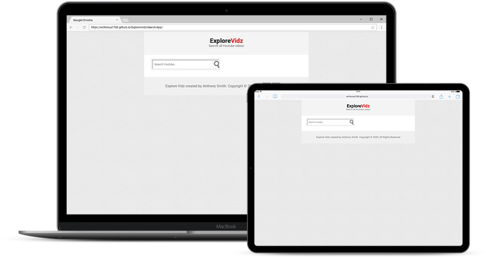

# Explore Vidz

Search and find any Youtube video using the Youtube Data API V3

## Project Specifications

- Search, Display and play any Youtube video 
- Use the Youtube Data API v3 ( so we can have youtube search engine all on our site)
- Animated search box ( when we click in the search box, it will extend. When we click out, it will shrink)
- We use the channelList and searchList methods
- We use the FancyBox plugin to open videos (We don't want the search engine to find the videos, and then have us click on them, then take us to youtube to watch them. We want them right on site)
previous and next paging
 
## Steps to execute this App:
- Download the entire code 
- Open up the index.html.
- [View Live Site](https://anthonys1760.github.io/Explore-Vidz-Search-App/)

## Technologies used: 
- HTML
- CSS
- Javascript

